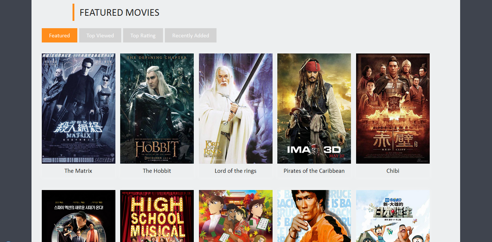
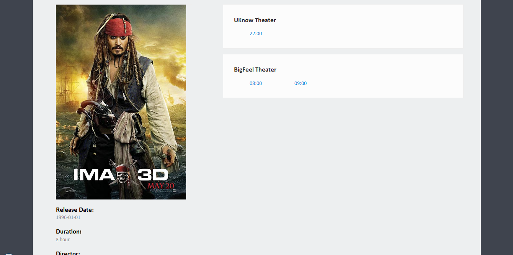
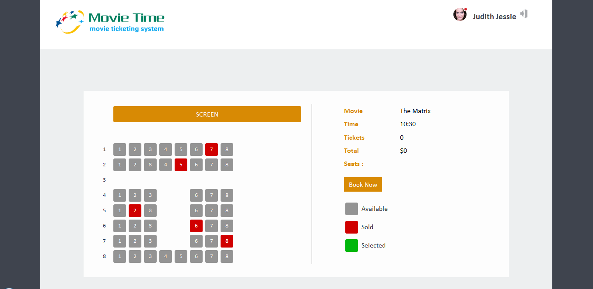
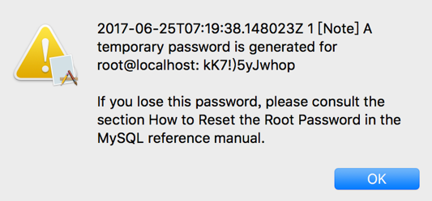

# MovieTime

Movie Time 电影售票系统 项目最终制品

## 展示截图

### 首页

### 选场次

### 选座

## 安装部署说明

* #### 数据库设置

  本项目数据库设置如下：
  > 数据库名：movietime
  > 用户名：root
  > 密码：123456​

  具体设置步骤如下：
  1. 下载安装MySQL数据库服务器。安装向导会提供数据库初始密码，需要记录下来。

      

      然后将MySQL安装目录的bin目录添加到PATH环境变量。

  2. 打开命令行，输入下列命令来登录数据库

      `mysql -uroot -p`

      然后输入初始密码，回车。

  3. 修改服务器密码。在命令行输入下面的指令

      `set password for root@localhost = password('123456');`

  4. 建立数据库。在命令行输入下面的指令

      `createdatabase movietime;`

  5. 向数据库导入初始化数据。在命令行依次输入下列指令

      `use movietime;`

      `	source <项目目录>/sql/movietime.sql`

      如此就完成了数据库的配置。

* #### 安装JDK

 ​   [下载JDK](http://www.oracle.com/technetwork/java/javase/downloads/jdk8-downloads-2133151.html)并安装，然后将JDK安装目录的Bin目录加入到PATH变量。

* #### 导入项目

  将项目导入Eclipse或Intellij IDEA，需要选择导入Maven项目，通过`pom.xml`导入。

* #### 启动服务端

  使用`jetty:run`命令启动项目。
  服务端的启动可能需要15~30秒。

* #### 访问网站

 ​   使用浏览器访问项目首页：http://localhost:8080/