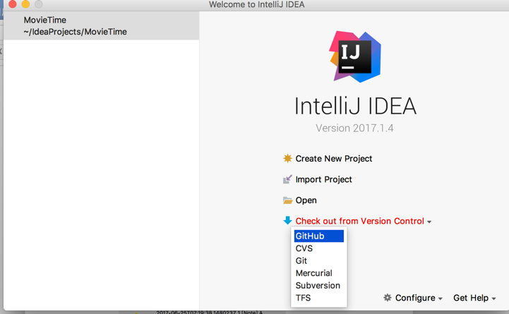
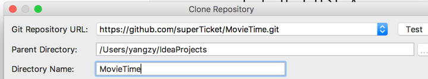
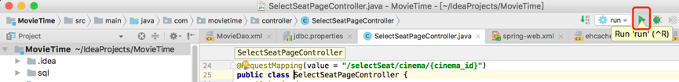

# Movie Time

*Movie Time* 是一个基于SpringMVC的在线电影售票系统。

# 部署说明

* #### 下载代码库

  1. [下载Intellij](http://www.jetbrains.com/idea/download/)，安装
  2. 如下图一所示，在欢迎界面选择Checkout from Version Control，按向导提示登录Github账号，按下图二填好git URL，记录这里所设置的**项目路径**。如下图二的项目路径为/Users/yangzy/IdeaProjects/MovieTime/

​		完成后点击Clone按钮。

​

* #### 安装JDK

 ​[下载JDK](http://www.oracle.com/technetwork/java/javase/downloads/jdk8-downloads-2133151.html)并安装，然后将JDK安装目录的Bin目录加入到PATH变量。

* #### 安装MySQL数据库

  > 数据库名：movietime
  >
  > 用户名：root
  >
  > 密码：123456​

  1. 下载MySQL数据库服务器，并安装。安装向导会提供数据库初始密码，请记录之。

    

    然后将MySQL安装目录的bin目录添加到PATH环境变量。

  2. 打开命令行，输入下列命令来登录数据库。

    `mysql -uroot -p`

    然后输入初始密码，回车.

  3. 修改服务器密码。在命令行输入下面的指令

    `set password for root@localhost = password('123456');`

  4. 建立数据库。在命令行输入下面的指令

    `createdatabase movietime;`

  5. 向数据库导入初始化数据。在命令行依次输入下列指令

    `use movietime;`

    `	source <项目目录>/sql/movietime.sql`

    如此就完成了数据库的配置.

* #### 运行服务端

 ​打开Intellij，点击下图所示的按钮即可

​	服务器的启动可能需要15~60秒。

 

* #### 访问网站

 ​用浏览器访问http://localhost:8080/